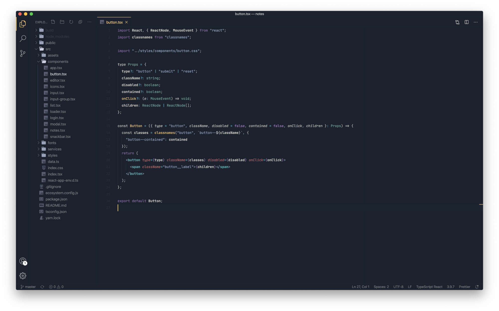
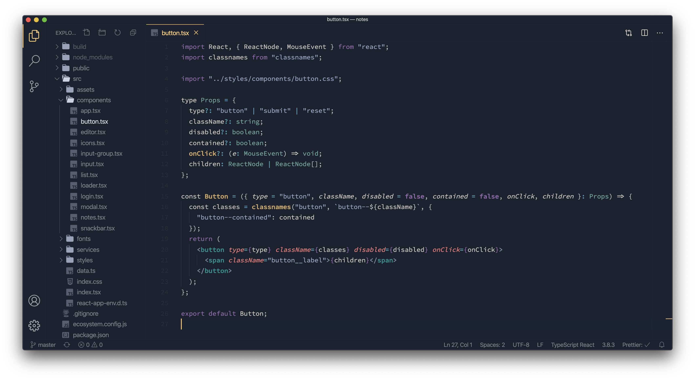
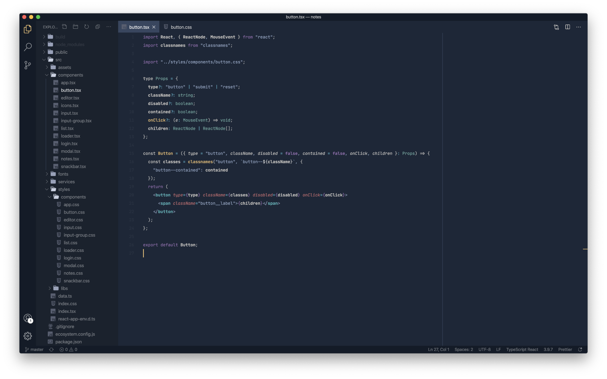
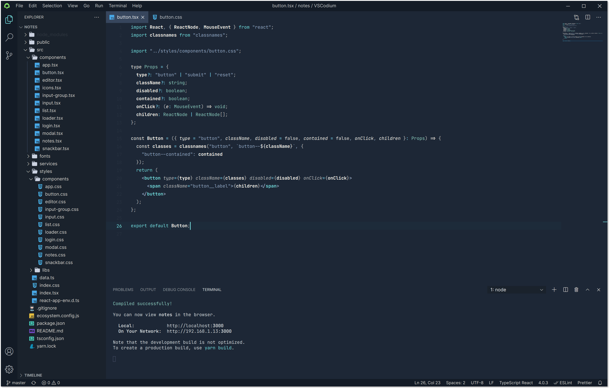

# Desaturated Theme

## Introduction

This theme's main goal is to provide a dark, readable & clean experience into your favorite code editor.

There is also 4 variants included :

- No bold
- No italic
- No italic & bold
- Flat (no-borders)

Created by [Jean Tinland](https://www.jeantinland.com)

## Preview

Flat (no-borders) variant

Light variant

## Colors

| Color                                                                   | Hex Code  | Used for                                                                        |
| ----------------------------------------------------------------------- | --------- | ------------------------------------------------------------------------------- |
|  Light blue     | `#98A8C5` | Strings - Comments - Tag brackets                                               |
|  Light red      | `#E78482` | Tag attributes - Units                                                          |
|  Light green    | `#8FC8BB` | Static types - Provided values, functions, variables                            |
|  Yellow         | `#FFD484` | Names entities - Function names - Storage keywords - Regex - JSON property name |
|  Blue           | `#6DB3CE` | Escape characters - Operators - Special operators                               |
|  Magenta        | `#AD82CB` | Constants - Pseudo CSS - Keywords                                               |
|  Cyan           | `#7EDDDE` | Tags                                                                            |
|  White / yellow | `#FFF9EE` | Inherited classes - CSS ID selectors - Variables names                          |

## Installation

Launch VS Code Quick Open (⌘+P), paste the following command, and press enter.

`ext install jean.desaturated`

Or install this theme from the extension panel : search for "_desaturated theme_".

You can find this theme in the Visual Studio Code Marketplace.

## Support

As I work mainly with **Javascript**, **Typescript**, **HTML/CSS** & **PHP**, these are for now the only fully supported languages.

Do not hesitate to contact me if you have some suggestions of improvements or language addition requests.

**Enjoy!**
