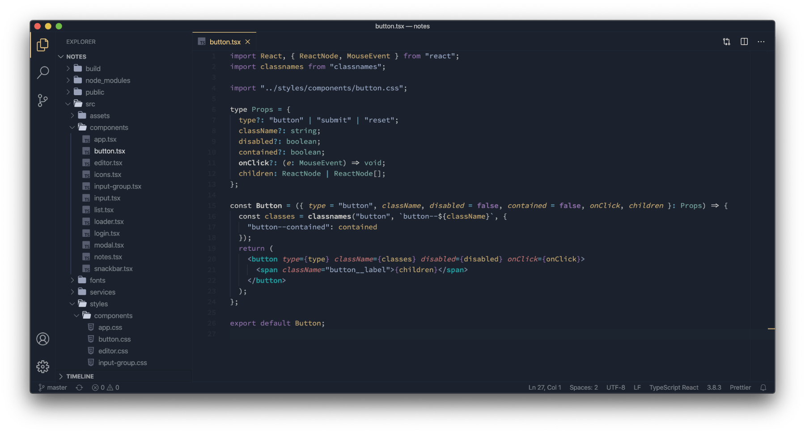
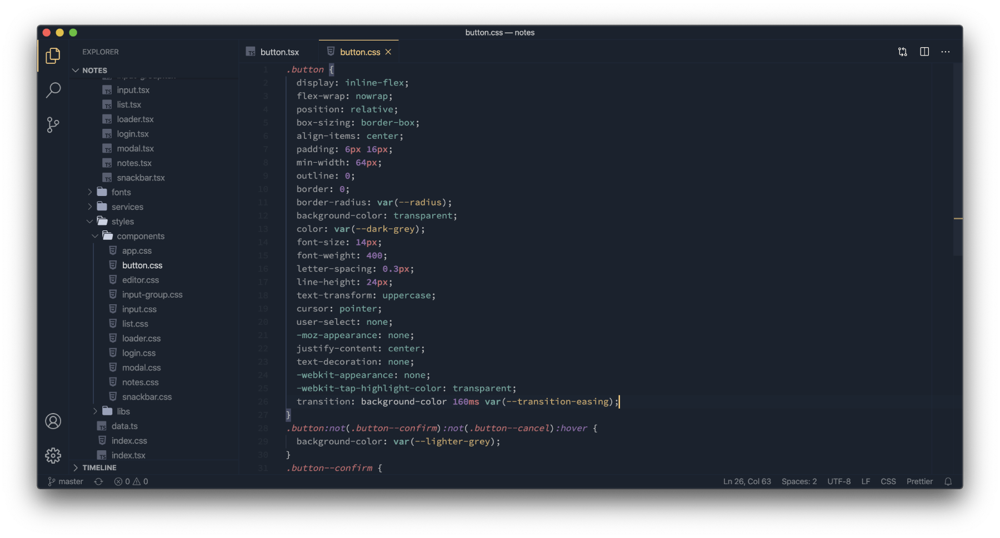

# README

## Introduction

This theme's main goal is to provide a dark, readable & clean experience into your favorite code editor.

## Screenshots

## Colors

| Color                                                                   | Hex Code  | Used for                                                                    |
| ----------------------------------------------------------------------- | --------- | --------------------------------------------------------------------------- |
|  Light blue     | `#98A8C5` | Strings - Comments - Tag brackets                                           |
|  Light red      | `#E78482` | Tag attributes - Units                                                      |
|  Light green    | `#8FC8BB` | Static types - Provided values, functions, variables                        |
|  Yellow         | `#F0C981` | Inherited classes - CSS ID selectors - Variables names - JSON property name |
|  Blue           | `#6DB3CE` | Escape characters - Operators - Special operators                           |
|  Magenta        | `#AD82CB` | Constants - Pseudo CSS - Keywords                                           |
|  Cyan           | `#20C5C6` | Tags                                                                        |
|  White / yellow | `#FFF9EE` | Names entities - Function names - Storage keywords - Regex -                |

## Installation

Launch VS Code Quick Open (⌘+P), paste the following command, and press enter.

`ext install jean.desaturated`

Or install this theme from the extension panel : search for "_desaturated theme_".

You can find this theme in the Visual Studio Code Marketplace.

## Misc

Do not hesitate to contact me if you have some suggestions of improvements.

**Enjoy!**
