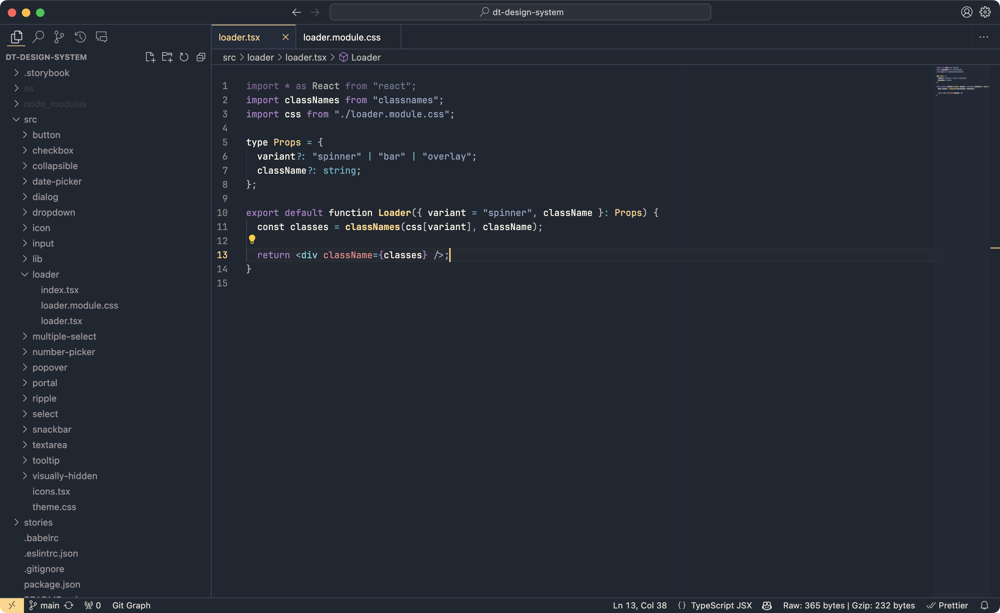

# Night Shift Theme

## Introduction

This theme's main goal is to provide a dark, readable & clean experience into your favorite code editor.

In order to stay soft to the eyes, it uses a desaturated color palette and uses only bold characters for function names as they are what describes your code the better.

Visit [Night Shift website](https://jean-tinland.github.io/night-shift-demo/) for more info. You can find the light version of this theme [here](https://marketplace.visualstudio.com/items?itemName=jean.day-shift-theme).

You'll find an iTerm2 port of this theme [here](https://github.com/Jean-Tinland/iTerm2-theme-desaturated).\
A Warp Terminal port is available [here](https://github.com/Jean-Tinland/warp-night-shift-theme).\
A Google Chrome port is available [here](https://github.com/Jean-Tinland/chrome-theme-desaturated).

## Preview



## Colors

| Color                                                                   | Hex Code  | Used for                                                                                                                                                       |
| ----------------------------------------------------------------------- | --------- | -------------------------------------------------------------------------------------------------------------------------------------------------------------- |
|  Medium blue    | `#74829b` | Comments                                                                                                                                                       |
|  Light blue     | `#98a8c5` | Strings, Tag brackets                                                                                                                                          |
|  Blue           | `#6db3ce` | Operators, Special operators, Provided (support) values                                                                                                        |
|  Red            | `#e78482` | Tag attributes, Pseudo CSS                                                                                                                                     |
|  Green          | `#8fc8bb` | CSS constant; Provided functions & variables                                                                                                                   |
|  Yellow         | `#ffd484` | Function names, Static types, CSS transition name/ID selectors/colors/include/mixins params, Inherited classes, Object/JSON property names, Language variables |
|  Magenta        | `#ad82cb` | Constants, Keywords                                                                                                                                            |
|  Cyan           | `#7eddde` | Tags, CSS class selector                                                                                                                                       |
|  White / yellow | `#fff9ee` | Named entities, CSS units, Variable names, Storage keywords, Regex, CSS property names, Parameters                                                             |

## Installation

Launch VS Code Quick Open (⌘+P), paste the following command, and press enter.

`ext install jean.desaturated`

Or install this theme from the extension panel : search for "_Night Shift Theme_".

You can find this theme in the Visual Studio Code Marketplace.

## Customization

If you want to get rid of all bold or italic text, you can add these lines to your `settings.json` file :

```json
  "editor.tokenColorCustomizations": {
    "textMateRules": [
      // Remove bold
      {
        "name": "Function names",
        "scope": "entity.name.function",
        "settings": {
          "fontStyle": "",
        }
      },
      // Remove italics
      {
        "name": "Comments",
        "scope": "comment",
        "settings": {
          "fontStyle": "",
        }
      }
    ]
  },
```

If you want to override anything else, you can see all the style definitions [here](https://github.com/Jean-Tinland/vscode-theme-night-shift/blob/master/themes/color-theme.json#L175C19-L175C19) in the github repo.

## Support

As I work mainly with **Javascript**, **Typescript**, **HTML/CSS** & **PHP**, these are for now the only fully supported languages.

Do not hesitate to contact me if you have some suggestions of improvements or language addition requests.
