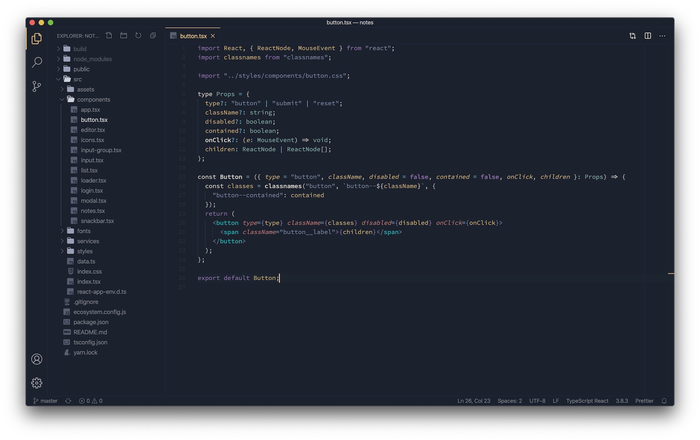
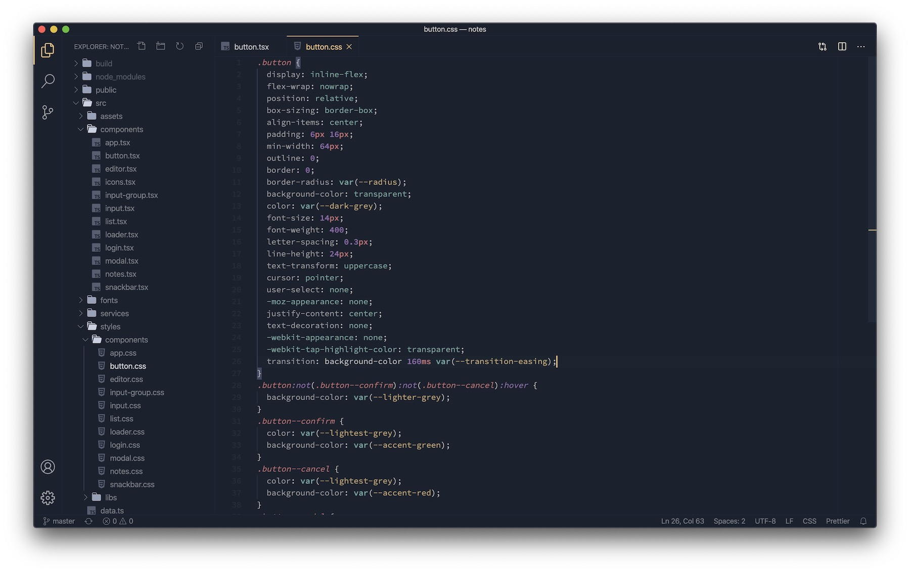

# README

## Preview

Sample 1:

Sample 2:

## Installation

Launch VS Code Quick Open (⌘+P), paste the following command, and press enter.

`ext install theme-desaturated`

Or install this theme from the extension panel : search for "_desaturated theme_".

You can find this theme in the Visual Studio Code Marketplace.

**Enjoy!**
